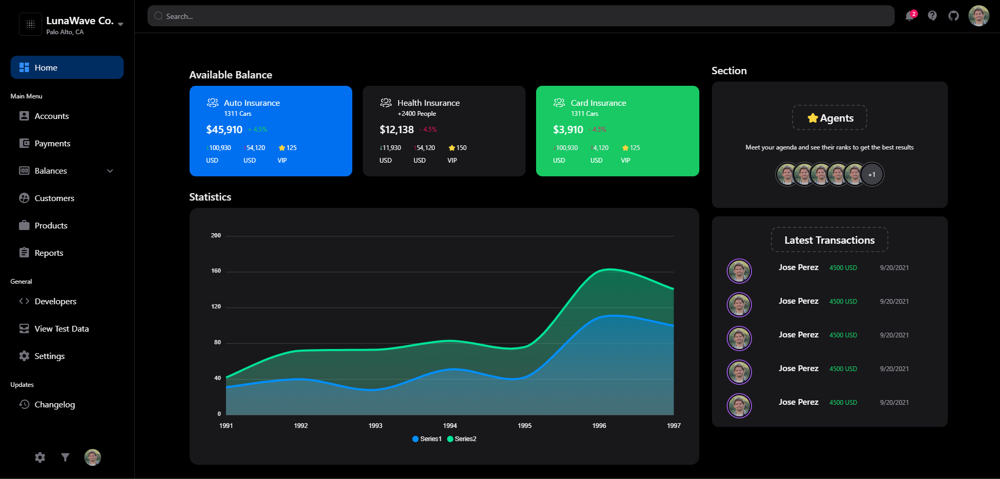
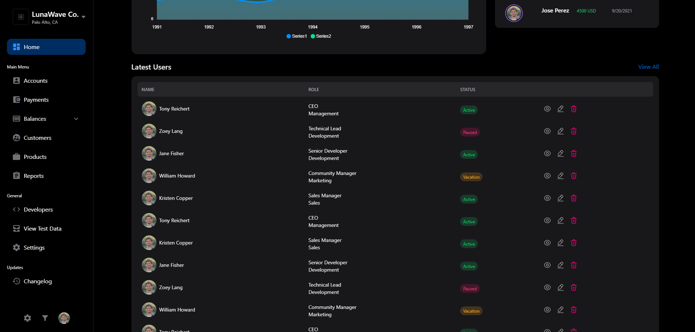
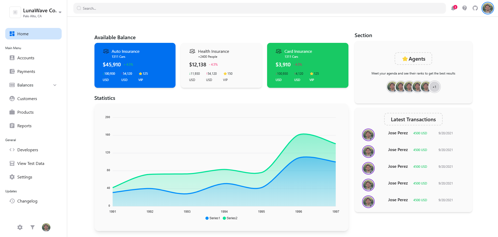
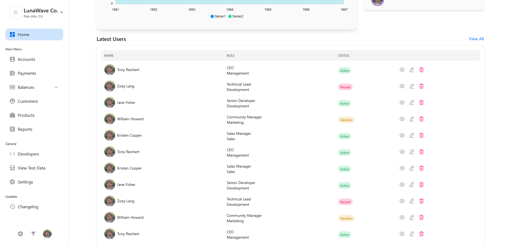

# Dashboard Application

This project is a responsive and highly customizable dashboard application built with Next.js and NextUI. Designed with a focus on user experience and flexibility, this dashboard can seamlessly integrate into various types of web applications, providing a robust foundation for managing and visualizing data.

Leveraging the power of Next.js, the application benefits from server-side rendering, fast page loads, and a scalable architecture, making it ideal for modern web environments. The use of NextUI ensures a sleek, visually appealing interface with ready-to-use, accessible components that enhance productivity and maintain design consistency.

Fully responsive and adaptive to any device, this dashboard automatically adjusts its layout for optimal display on desktops, tablets, and mobile devices. The modular design enables easy customization, allowing developers to expand or modify features based on specific application needs, whether it's adding new data visualizations, managing additional user information, or integrating with third-party services.

With this dashboard, you have a powerful, ready-to-integrate solution for building insightful and interactive user experiences across diverse applications.

### Dark Mode




### Light Mode




## For Run

Install dependencies

```bash
npm install
```

Start the server

```bash
npm run dev
```

Now you can visit https://localhost:3000 in your browser.
